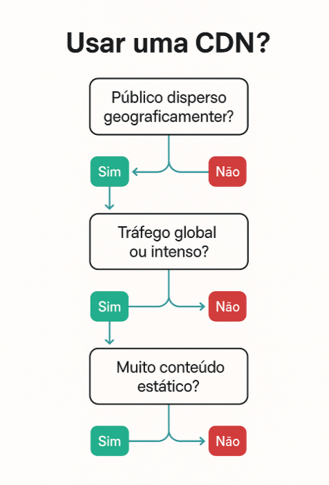
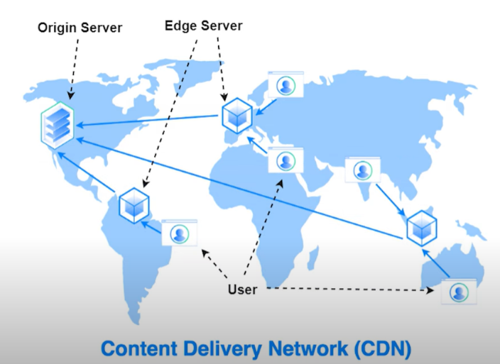
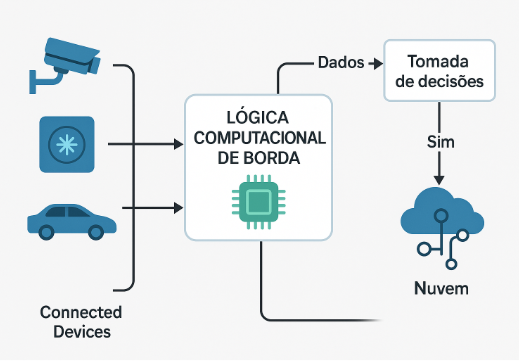

= Cenário Arquitetural: CDN-Quando usar e quando não usar

ifndef::env-gitlab[]

endif::[]

ifdef::env-gitlab[]
image::../../images/cenario_arquitetural.png[,100%]
endif::[]

{blank} +

*Nome:* CDN-Quando usar e quando não usar
*Status:* Ativo
*Classe:* Rede
*Tags:* CDN, Edge, Cache

*Histórico de Revisões*

|===
| Data | Versão | Descrição | Autor

| 18/08/2025
| 1.0
| Criação do Documento
| Joel Guedes
| 18/08/2025
| 1.1
| Revisão do Documento
| Luiz Lemos
| 21/08/2025
| 1.2
| Revisão do Documento, ajuste ao padrão de estrutura de tópicos
| Joel Guedes
| 29/10/2025
| 1.3
| Revisão do Documento, ajuste para exibição das imagens
| Joel Guedes
|===

{blank} +

== 1. Contextualização

Este documento visa relacionar os cenários favoráveis e os desfavoráveis à utilização de CDN e, a partir de tais cenários, orientar na tomada de decisão na escolha se o CDN se aplica ou não à necessidade do cliente.

{blank} +

== 2. Descrição

A sigla CDN significa Content Delivery Network, que literalmente é uma Rede de Entrega de Conteúdo. 
{blank} +
CDN surgiu para resolver problemas de congestionamento advindos de conteúdo rico e pesado na internet, como gráficos e vídeos. 
{blank} +
Atualmente, grande parte do conteúdo da internet é entregue via CDN através de servidores distribuídos pelo mundo (servidores Edge ou borda) que armazenam réplicas de conteúdo da aplicação web (imagens, vídeos e páginas), em cache. O acesso fica mais performático ao buscar conteúdos nestes servidores, deixando de buscar no servidor origem da aplicação. 

{blank} +

== 3. Premissas

* Reduzir latência de rede ao minimizar a distância física do usuário ao servidor. Desta forma, evitar gargalos pela melhora da performance da aplicação web. 
* Melhorar a experiência online do usuário 
* Reduzir custos de infra
* Aumentar a disponibilidade da aplicação
* Oferecer proteção nos servidores edge
* Otimização SEO do projeto (buscas na web) 

{blank} +

=== Porque usar CDN, CDN Cloud e exemplos CDN

* As vantagens de usar uma CDN dependem do tamanho e das necessidades do ativo da internet 
* Graças à sua natureza distribuída, uma CDN consegue lidar com mais tráfego e resistir melhor às falhas de hardware 
* A maior parte do tráfego da web é distribuída por CDNs, incluindo Facebook, Netflix e Amazon.
* A Hulu é uma plataforma online de transmissão de vídeo da Walt Disney Company  que usa o Amazon CloudFront para transmissões maciças de dados 
* A Reuters usa o serviço CDN Amazon CloudFront; BBC, CNN, The New York Times e The Washington Post usam CDN 
* As CDNs oferecem escalabilidade para gerenciar ou assumir a carga de centenas de milhões de conexões simultâneas. A King produz jogos conectados, de plataforma cruzada, jogados a qualquer hora, em qualquer lugar e em qualquer dispositivo. A King usa o Amazon CloudFront para entregas maciças de dados. 
* Serviço CDN cloud nativo na frente da aplicação provê alta performance, escalabilidade, segurança e conveniência devido à infra da aplicação web na nuvem. Exemplos de serviços CDN Cloud: 
** CDN Amazon CloudFront 
** Azure Front Door 
** Google Cloud Media CDN 

{blank} +

== 4. Escopo

* Explicar o básico de CDN de forma simplificada abrangendo o conceito, termos técnicos associados e até trazendo exemplos práticos objetivando facilitar o entendimento e a aplicação de CDN
* Descrever e comparar cenários de aplicações web para viabilizar a decisão pelo uso ou não de CDN na aplicação, concluindo se atende ou não a necessidade do cliente

{blank} +

== 5. Não Escopo

* Esgotar o assunto CDN
* Direcionar a escolha do provedor de nuvem
* Apontar serviços ideais de CDN Cloud 
* Apontar infraestrutura adequada
* Apontar configurações ideais de CDN

{blank} +

== 6. Visão Arquitetural

=== ✅Usar CDN nestes cenários da aplicação web

* Amplo alcance geográfico 
* Grande volume de tráfego 
* Conteúdo estático pesado 
* Alta disponibilidade e resiliência 
* Exigência de segurança e proteção contra ataques 

{blank} +

=== ❌  NÃO usar CDN nestes cenários da aplicação web

* Aplicações internas ou restritas a poucos usuários ou uma única localidade (intranet) 
* Ambientes em desenvolvimento/teste (dificuldade em debug devido ao cache e distribuição de conteúdo) 
* Conteúdo altamente dinâmico e personalizado 
* Custo-benefício negativo para projetos pequenos (baixo tráfego, blogs pessoais) 

{blank} +

=== Critérios práticos para decidir quanto ao uso de CDN

|===
| **Critério** | **CDN recomendada ?**

| Público disperso geograficamente  | ✅ Sim  
| Tráfego global ou intenso  | ✅ Sim  
| Muito conteúdo estático | ✅ Sim  
| Conteúdo sensível ou interno  | ❌ Não  
| Site pequeno e de baixo tráfego | ❌ Não  
| Segurança contra DDoS é crítica  | ✅ Sim  
|===

{blank} +

=== Árvore de decisão

//image::imagem_2_arvoredecisao.png[]

ifndef::env-gitlab[]

endif::[]

ifdef::env-gitlab[]
image::../../images/imagem_2_arvoredecisao.png[,40%]
endif::[]

{blank} +

=== Configurações possíveis: 

* Setar o tempo de invalidação para forçar a atualização do cache 
* Definir os tipos de arquivos buscados no servidor de origem e a frequência 
* Ativar a proteção contra ataques maliciosos comuns, como ataques de negação de serviço distribuída (DDoS). 
* Programar o Servidor Edge customizando a comunicação entre o cliente e o servidor. 
* Contratar mais de um serviço de CDN, mas não é recomendável devido à redundância, podendo resultar em variações de custo desnecessários 

{blank} +

== 7. Infraestrutura

* Utiliza a infraestrutura de uma provedora, de nuvem ou local 
* Ocorre a replicação de conteúdos da aplicação web do servidor central para servidor edge em caso de ausência ou desatualização de tais conteúdos no servidor edge.  Nas execuções seguintes da aplicação a CDN carrega deste servidor edge (cache), com rapidez e eficiência. Servidor edge também é chamado de ponto de presença (POP), são de propriedade ou gerenciados pelo provedor de hospedagem CDN, que identifica sua localização para entregar conteúdo do servidor mais próximo. 
* Servidores nos pontos de troca de tráfego (PTTs), entre redes diferentes, aprimoram a conectividade e melhoram a performance, pois realizam conexões de alta velocidade e altamente interconectados 

//image::Imagem_1_EdgeServer.png[]

ifndef::env-gitlab[]

endif::[]

ifdef::env-gitlab[]
image::../../images/Imagem_1_EdgeServer.png[,40%]
endif::[]

{blank} +

== 8. Considerações Finais

* CDN pode entregar conteúdo estático e conteúdo dinâmico 
* Conteúdo estático é o conteúdo ideal para ser armazenado em uma CDN. 
* O perfil do público consumidor, o tipo de conteúdo e objetivos de desempenho compõem os principais cenários favoráveis e desfavoráveis ao uso de CDN 

{blank} +

=== Resumo de quando usar e quando não usar CDN na aplicação web

|===
| **Critério** | **Usar CDN ✅ ** |   **Não Usar CDN ❌**

| **Alcance geográfico**  | Usuários distribuídos em diferentes regiões | Usuários concentrados em uma única localidade
| **Volume de tráfego** | Alto tráfego, picos de acesso | Tráfego baixo ou previsível 
| **Tipo de conteúdo** | Estático: imagens, vídeos, CSS, JS  | Altamente dinâmico: dashboards, ERPs 
| **Objetivo de desempenho** | Reduzir latência, melhorar tempo de carregamento  | Latência não é crítica 
| **Escalabilidade** | Crescimento ou campanhas | Projeto pequeno, sem expectativa de escalada  
| **Disponibilidade** | Requer alta disponibilidade e tolerância a falhas | Sistemas tolerantes a falhas temporárias 
| **Segurança** | Precisa de proteção DDoS e WAF  | Ambiente seguro e controlado localmente
| **Ambiente de uso** | Produção pública (sites, apps, e-commerce)  | Desenvolvimento, teste ou uso interno
| **Custo x benefício** | Justificado por ganho de performance e escala   | Custo elevado sem retorno em projetos simples
|===

{blank} +

== 9. Glossário

==== CDN POP (Point of Presence) ou Servidores Edge (de borda)

* Local físico (um data center ou parte dele) onde há servidores da CDN. Esses servidores armazenam cópias dos conteúdos mais acessados, chamados de caches. 
* As réplicas nestes caches funcionam como uma mini loja ou depósito local, perto da sua casa, que já tem o produto pronto para entrega rápida. 

{blank} +

==== Servidor no ponto de troca de tráfego (PTT):

* Aprimoram a conectividade entre redes diferentes , melhoram a performance devido às conexões de alta velocidade e altamente interconectados. 
* Funciona como um centro de distribuição de encomendas entre transportadoras, facilita que as redes (como provedores de internet) troquem pacotes entre si de forma eficiente. 

{blank} +

==== Lógica computacional de borda (servidores Edge) 

* É fazer a “inteligência” acontecer o mais próximo possível de onde os dados são gerados (analisando, filtrando, classificando ou até tomando decisões localmente)
* É o processamento, armazenamento, rede e inteligência  disponíveis na borda da rede (edge) e dispositivos, próximo de onde os dados são gerados e consumidos (como sensores, câmeras, gateways, roteadores inteligentes, dispositivos IoT,  carros autônomos) independentes da nuvem ou servidores centrais. Observe a imagem abaixo:  

//image::imagem_3_logcompborda.png[]

ifndef::env-gitlab[]

endif::[]

ifdef::env-gitlab[]
image::../../images/imagem_3_logcompborda.png[,40%]
endif::[]

{blank} +

== 10. Referências

* O que é CDN, porque usar: 
** https://aws.amazon.com/pt/what-is/cdn/ 
** https://www.cloudflare.com/pt-br/learning/cdn/what-is-a-cdn/ 
** https://www.akamai.com/pt/glossary/what-is-a-cdn 
** https://www.youtube.com/watch?v=2geXZqSeulA
** link:https://aws.amazon.com/caching/cdn/[Armazenamento em cache]  

* link:https://aws.amazon.com/cloudfront/[Amazon Cloud Front] 
* link:https://www.cloudflare.com/learning/cdn/glossary/internet-exchange-point-ixp/[Cloud Flare: Pontos de Troca de Tráfego na internet (PTTs)]
* link:https://www.akamai.com/pt/glossary/what-are-dns-servers[Akamai: Servidores de DNS]
* link:https://www.cloudflare.com/learning/ddos/what-is-a-ddos-attack/[Ataques de negação de serviço distribuída (DDoS)]
